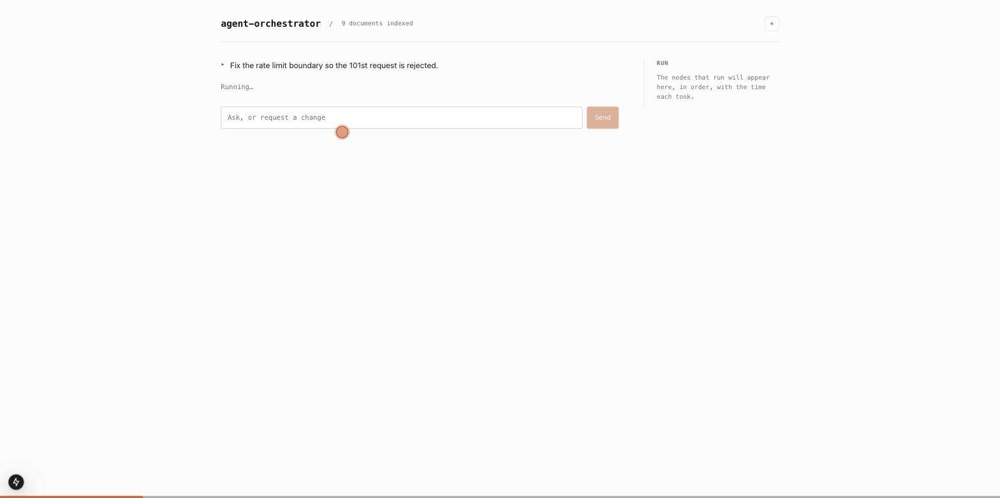
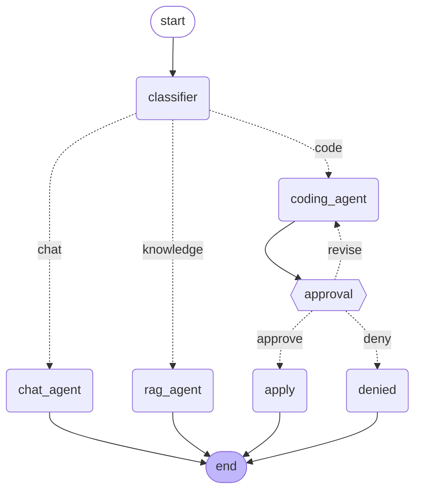
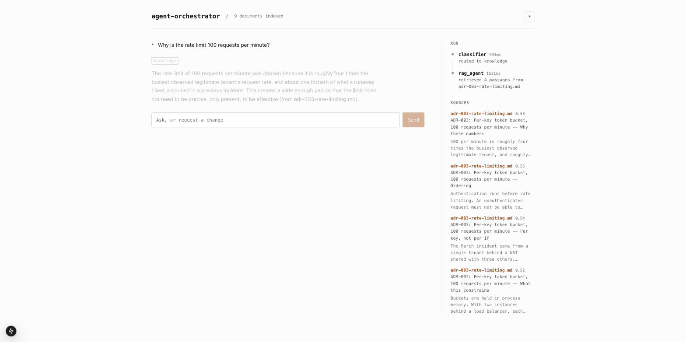
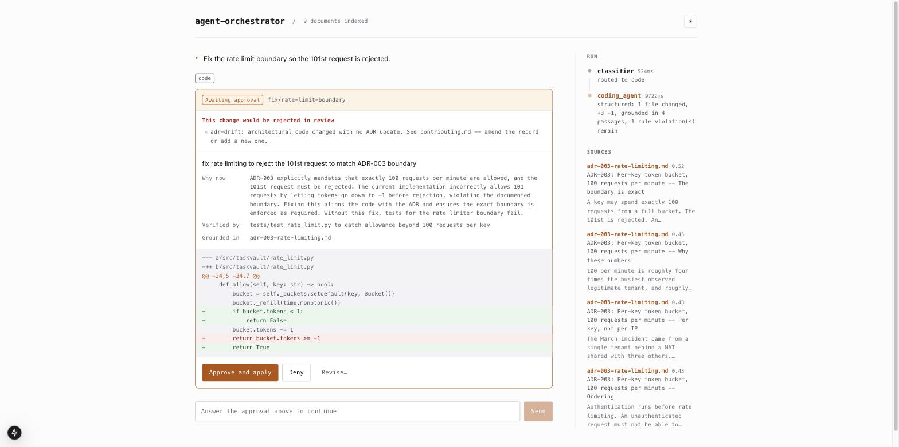

# Agent Orchestrator

A LangGraph orchestrator that routes a message to one of three agents — and, on
the coding branch, stops mid-run to ask a human before it writes anything.

The interesting part is not the routing. It is that the coding agent **reads the
documentation before it reads the code**, because the decisions that constrain a
change are recorded in ADRs and nowhere else. A model given only the source will
write something reasonable and wrong.



*One real run: the request is classified, the coding agent reads the ADRs and
proposes a diff, the graph suspends, a human approves, and TaskVault's own lint,
format and test jobs run against the result.*



## Running it

```bash
cp backend/.env.example backend/.env   # add your OPENAI_API_KEY
docker compose up --build
```

Then open <http://localhost:3000>. The API is on <http://localhost:8000>, with
OpenAPI docs at `/docs`.

<details>
<summary>Running the halves separately</summary>

```bash
cd backend && uv sync --extra dev && uv run uvicorn app.main:app --reload
cd frontend && npm install && npm run dev
```
</details>

## What it works on

`backend/workspace/` is **TaskVault**, a small task API with API-key auth, SQLite
storage and per-key rate limiting. It is the codebase the coding agent edits, and
it is deliberately imperfect: its test suite is green while the code contradicts
its own documentation in four places.

| Gap | The code does | `docs/` says |
| --- | --- | --- |
| Rate limit boundary | allows 101 requests | `adr-003`: the 101st is rejected |
| `GET /tasks?status=` | filter is ignored | `api.md`: filters to that state |
| Title length | any length accepted | `api.md`: over 200 chars is a 400 |
| Health check | touches nothing | postmortem: should exercise a real query |



That gap is the point. **An agent that only reads code sees a healthy project.**
Retrieval is load-bearing here rather than decorative, and you can demonstrate it
by deleting an ADR and watching the same request produce a different design.

## The corpus

Nine documents, ~16KB, living in `backend/workspace/docs/` — beside the code they
describe rather than in the orchestrator, because the review rules require a
change to the architecture to update the record explaining it, and that is only
enforceable if the agent can edit both.

Three ADRs, an API contract, a style guide, contribution conventions, a CI
description, a runbook, and the postmortem that produced the rate limit. Chunked
on headings, then on paragraphs past 700 characters, so a chunk is one subject.

## Pull requests and CI

A proposal is checked against the review rules *before* a human sees it
(`app/tools/policy.py`), and one revision is attempted automatically — a reviewer
should not be spent on a missing commit prefix. The rules mirror TaskVault's own
`ci.yml`:



- **`adr-drift`** — a change to `rate_limit.py`, `storage.py` or `auth.py` must
  also change an ADR. This is what makes a correct fix more than a code edit: the
  agent has to retrieve the record, fix the boundary, *and* update the reasoning.
- Conventional commits, `type/short-description` branches, at most three files.
- A PR body answering what changes, why now, and how it was verified — plus a
  disclosure naming the documents the agent consulted, so a reviewer can audit
  the grounding. An agent may not approve a pull request.

Once approved, `apply` writes the files, runs TaskVault's real lint/format/test
jobs locally, and publishes the pull request with the results attached.

## Two coding strategies

How a change gets produced is a strategy behind one interface (`app/agents/`).
Neither may write to the workspace; both hand back a `CodeProposal` that the
graph checks and holds at the gate.

| | `structured` (default) | `claude_code` |
| --- | --- | --- |
| How | One model call returns complete file contents | Delegates to `claude -p` |
| Explores | No — sees only the source it was handed | Yes: reads, edits, re-runs tests |
| Needs | An API key | The CLI on PATH, authenticated |
| Speed | Seconds | Tens of seconds |

Set `ORCHESTRATOR_CODE_AGENT=claude_code` to switch.

The delegating strategy runs Claude Code against a **throwaway copy** of the
workspace, then diffs the copy and deletes it. `--permission-mode acceptEdits` is
safe there precisely because the directory is disposable — and this is the whole
design point:

> Pointing `claude -p --permission-mode acceptEdits` at the real workspace makes
> the approval gate a notification. The files are already changed by the time
> `interrupt()` runs. Editing a copy keeps the CLI's full capability while
> keeping the human decision authoritative.

Claude Code does the engineering; a structured call afterwards writes the
paperwork, so the proposal still carries a branch, a conventional commit subject
and a reviewable body for the policy checks to judge.

## Human in the loop

`interrupt()` suspends the graph at `approval`; the checkpointer persists
everything up to that point; `/approve` resumes it with `Command(resume=...)`.

The pause outlives the HTTP request, which is why the checkpointer is SQLite
rather than in-memory — with more than one worker, an in-memory checkpoint is
invisible to whichever process handles the resume. `GET /threads/{id}/history`
shows the checkpoints, which is the honest way to demonstrate that the run really
did stop and resume rather than starting over.

Resuming replays the approval node from the top, so it does nothing before its
`interrupt()` call. Any side effect above that line would happen twice.

## Layout

```
backend/
  app/
    graph/          state, wiring, and one file per node — imports no FastAPI
    knowledge/      corpus loader and the retrieval store, shared by two agents
    tools/          sandbox filesystem, diffing, review rules, PR publishing
    routers/        HTTP surface
    service.py      the seam: graph results become API responses
  workspace/        TaskVault — the sandbox, with its own tests, CI and docs
    agents/         the two coding strategies, behind one Protocol
  tests/            58 tests, no API key required
frontend/           Next.js: chat, trace rail, approval dialog
```

The graph never imports FastAPI, and the routers never touch the graph directly.
That is what makes the graph testable without a server, runnable in LangGraph
Studio, and reusable from a CLI.

## Safety

The coding agent's filesystem access is confined to `backend/workspace/`. Paths
are checked **after** resolution, so `../` and symlinks out are both refused, and
CI configuration is not writable — the agent may change the service, not the
rules it is judged by. Nothing is written until a human approves.

## Tests

```bash
cd backend && uv run pytest -q          # 58 passed
cd backend/workspace && uv run pytest -q # 8 passed
cd frontend && npm test                 # 17 passed
```

The backend suite needs no API key: it substitutes a scripted model and
deterministic embeddings, which keeps assertions about routing and the approval
gate deterministic. Retrieval *quality* is a question for evals, not unit tests.
